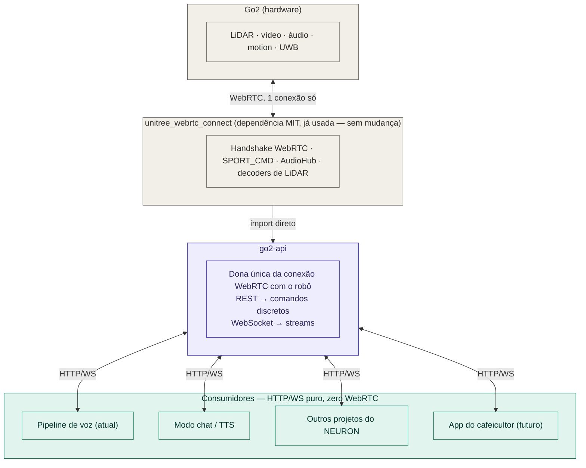

# Arquitetura — `go2-api`

> O que está implementado e o que é plano estão separados na seção 4 (coluna **Status**). Para o comportamento da lib por baixo, ver [`lib_unitree_webrtc_connect.md`](lib_unitree_webrtc_connect.md).

## Resumo em uma frase

A `go2-api` é uma camada nova, fina, que fica **entre** a biblioteca `unitree_webrtc_connect` (que já existe e continua sendo usada, sem mudança) e **todo mundo que hoje precisa falar com o robô** — incluindo o projeto de controle por voz do NEURON, que passa a ser *cliente* da API em vez de dono da conexão com o robô.

---

## 1. Onde ela entra — diagrama de camadas



*Cinza = dependências externas · roxo = `go2-api` · verde-azulado = consumidores da API.*

**A resposta direta pra "onde minha API entra":** ela não substitui a `unitree_webrtc_connect` — ela **assume a responsabilidade que hoje está espalhada dentro do `robot_control`**, generaliza, e vira o único ponto de contato com o robô. Tudo que hoje precisa saber WebRTC/AES/`aiortc` passa a precisar saber só HTTP e WebSocket.

---

## 2. O que muda no fluxo que já existe

### Antes (hoje)
```
TV Box → TCP → inferência (Whisper + SentenceTransformer) → Redis "go2:commands"
                                                                    ↓
                                          robot_control (importa unitree_webrtc_connect
                                          direto, monta SPORT_CMD, fala com o robô)
```

### Depois — decidido: sem Redis nesse caminho
```
TV Box → TCP → inferência (sem mudança) ──HTTP direto, não-bloqueante──▶ go2-api
                                                                          │
                                                              POST /commands/{posture,gesture,move,...}
                                                                          │
                                                          unitree_webrtc_connect → Go2
```

**Decisão registrada**: o `robot_control` e o Redis somem do caminho de comando de voz — a inferência chama a `go2-api` direto via HTTP. Isso não abre mão de garantia nenhuma: o Redis pub/sub de hoje já não confirma entrega (mensagem publicada sem ninguém ouvindo simplesmente some — problema documentado no dossiê). Uma resposta HTTP (`200`/erro) já é uma confirmação melhor do que o que existe hoje.

**Duas condições pra isso não criar um problema novo** (o motivo de existir uma camada no meio nunca foi "confiabilidade", foi "não travar o pipeline de voz esperando o robô se mexer"):
1. A `go2-api` responde **assim que aceita o comando** (`202 Accepted`), não depois que o robô termina de executar fisicamente.
2. A chamada, do lado da inferência, roda como tarefa solta (`asyncio.create_task`), nunca como `await` bloqueante no meio do loop principal.

**O que preserva o isolamento de processo** (o valor real que o Redis dava) não era o Redis em si — é **serem containers separados**. Chamada HTTP entre dois containers separados preserva isso do mesmo jeito: se a `go2-api` cair, a chamada falha/dá timeout, a inferência captura a exceção e segue rodando, sem travar.

**Fora de escopo por enquanto**: o modo chat (que também usa Redis pub/sub hoje) não foi implementado corretamente ainda — fica de fora dessa decisão. Primeiro a `go2-api`, o redesenho do modo chat (incluindo se ele também abre mão do Redis) fica pra depois, como projeto separado.

---

## 3. Por que isso resolve um problema estrutural, não só estético

O WebRTC é ponto-a-ponto — **só uma conexão por vez** com o robô (é a causa do `RobotBusyError`). Isso significa que, hoje, se dois processos quisessem falar com o robô ao mesmo tempo, um dos dois perderia.

A `go2-api`, sendo a **única dona da conexão WebRTC**, resolve isso por construção: ela mantém 1 conexão física com o robô, mas multiplexa quantos consumidores HTTP/WS quiserem — o pipeline de voz, o modo chat, um projeto novo de outro colega do NEURON, tudo ao mesmo tempo, sem brigar pela mesma conexão. Isso não é só "mais bonito", é a solução pro limite físico do protocolo.

---

## 4. Superfície da API — implementado e planejado

Cinco grupos: os quatro primeiros são REST (comando pontual), o quinto é WebSocket (fluxo contínuo).

**Status:** ✅ implementado · 🔜 planejado para o v1 · ⏸ registrado, fora do v1 (`todo-later`). Os números são issues do GitHub.

Convenções que valem para todo o REST (`README.md`): comandos respondem `202` ao **aceitar** o comando (não ao fim da execução física), `503` sem conexão com o robô e `504` quando um comando que espera resposta estoura `GO2_REQUEST_TIMEOUT_S`.

### 4.1 Postura e movimento
| Na lib | Endpoint | Status | Nota |
|---|---|---|---|
| `SPORT_CMD["StandUp"/"StandDown"/"Sit"/"RiseSit"/"BalanceStand"/"RecoveryStand"/"Damp"]` | `POST /commands/posture` `{"cmd": "stand_up"}` | ✅ | `cmd` como enum. Cancela um `move` em curso. |
| `SPORT_CMD["Move"]` | `POST /commands/move` `{"vx","vy","vyaw","duration_s"}` | ✅ | A API reenvia a `GO2_MOVE_RATE_HZ` (20–50 Hz) e manda `StopMove` no fim. Limites configuráveis → `422`. **Sem lease:** um `move` novo substitui o anterior (lease em #7). |
| `SPORT_CMD["StopMove"]` | `POST /commands/stop` | ✅ | Sempre executa, de qualquer cliente. |
| `SpeedLevel`/`GetSpeedLevel` | `PUT/GET /commands/speed` | ✅ | Único endpoint que espera resposta do robô (`504` em timeout). Payload pendente de validação física. |

### 4.2 Gestos e "truques"
| Na lib | Endpoint | Status | Nota |
|---|---|---|---|
| `Hello`, `Stretch`, `FingerHeart`, `WiggleHips`, `Content`, `Dance1/2`, `Scrape`, `Pose` | `POST /commands/gesture` `{"cmd": "hello"}` | ✅ | Baixo risco físico. |
| `FrontFlip`, `BackFlip`, `Handstand`, `MoonWalk`, `Bound` | `POST /commands/trick` `{"cmd": "front_flip", "confirm": true}` | 🔜 #1 | Separado de propósito: risco real de queda. Exige confirmação explícita. Nenhum foi testado ainda. Os ids diferem entre `SPORT_CMD` e `SPORT_CMD_MCF`; confirmar qual espaço vale para o robô. |
| `SPORT_CMD_MCF` (`TrotRun`, `StaticWalk`, …) | — | fora do v1 | Exige trocar o robô para o modo MCF (`motion_switcher`, não mapeado; dossiê 12.2/12.3). |

### 4.3 Dispositivo (áudio, LED, volume)
| Na lib | Endpoint | Status | Nota |
|---|---|---|---|
| `WebRTCAudioHub` (lista, upload, play, pause, resume, delete, megafone) | `/audio/*` | 🔜 #2 | Classe pronta, mas sem timeout, upload por caminho de arquivo e megafone em 3 chamadas (ver `lib_unitree_webrtc_connect.md` §7). Substitui o `CMD_PLAY_AUDIO` do modo chat. |
| `RTC_TOPIC["VUI"]` volume/brilho/LED | `PUT/GET /device/volume`, `PUT/GET /device/brightness`, `PUT /device/led` | 🔜 #3 | **api_ids (1003–1007) e payloads a confirmar:** não estão nas constantes da lib 2.2.0. |

### 4.4 Segurança e controle
| Na lib | Endpoint | Status | Nota |
|---|---|---|---|
| `SPORT_MOD_STATE`/`LOW_STATE` | `GET /status` | ✅ | Snapshot do cache em memória; sempre `200`, com `connected: false` se o robô estiver fora. `?raw=true` devolve os payloads crus. |
| `OBSTACLES_AVOID_API` (`SWITCH_SET`/`SWITCH_GET`) | `PUT/GET /safety/obstacle-avoidance` `{"enabled"}` | ⏸ #8 | Não está confirmado que o desvio filtra o `SPORT_CMD["Move"]` usado pela API (dossiê 12.1). |
| — (design próprio) | `POST /control/acquire`, `POST /control/release` | ⏸ #7 | Lease com token e expiração (dossiê seção 13). |

### 4.5 Streams (WebSocket)
| Fonte | Canal | Status | Nota |
|---|---|---|---|
| `LOW_STATE`/`SPORT_MOD_STATE` | `/ws/telemetry` | 🔜 #5 | Os tópicos acessíveis pelo WebRTC são os de baixa frequência (dossiê 12.4); a taxa real será medida. |
| `WebRTCVideoChannel` (track) | `/ws/video` | 🔜 #4 | Codificar quadros fora do event loop; formato no WS a decidir. |
| `ULIDAR_ARRAY` + decoder `native` | `/ws/lidar` | 🔜 #6 | O decoder padrão (`libvoxel`) devolve malha, não pontos. Basta `set_decoder("native")` a cada conexão; sem patch na lib. |

### 4.6 Desenho interno dos streams (planejado)

```
callbacks da lib ──publish──▶ TopicHub ──subscribe──▶ 1 asyncio.Queue por cliente WS
 (event loop, #12)            (#9, em memória)          (cheia → descarta a mais antiga)
```

- **`TopicHub` (#9):** `Topic(str, Enum)`, `subscribe(topic, maxsize=32) -> Queue`, `unsubscribe(topic, q)` (idempotente) e `publish(topic, data)` (síncrono, `put_nowait`). Envelope enviado aos clientes: `{"topic", "ts", "data"}`, com `ts = time.time()` no `publish`. Funciona só com um processo (`uvicorn` sem `--workers`).
- **Ponte driver → hub (#12):** reaproveita os callbacks que já alimentam o `/status`. A lib guarda **um callback por tópico**, e um segundo `subscribe` silenciaria o `/status`.
- **Refcount (#13):** assina no robô no primeiro cliente e cancela no último. `LOW_STATE`/`SPORT_MOD_STATE` nunca são cancelados, porque o `/status` depende deles.
- **Estado da conexão (#14):** tópico `connection` com `connected`/`disconnected` (e `reconnecting` quando houver reconexão automática).
- **Apoio ao desenvolvimento:** `FakeHub` (#10) gera dados simulados sem o robô; `scripts/ws_client.py` (#11) imprime mensagens e mede a taxa.

### Fora do escopo do v1
Navegação autônoma (`uslam`), UWB/side-follow e modo MCF: payloads ainda não mapeados (dossiê seção 12.2/12.3). Entram como v2+, se fizer sentido investir nisso depois. Reconexão automática ao robô ficou fora do MVP e entrou depois (`Go2Robot.keep_connected`, em `app/robot/service.py`).

---

## 5. Ordem de implementação

1. ✅ **Postura, movimento, velocidade, gestos e `/status`** (4.1, parte de 4.2 e 4.4): o que o `robot_control` já fazia, reorganizado.
2. 🔜 **Infraestrutura de streams** (4.6: #9, #10, #11, #12) e depois **`/ws/telemetry`** (#5), o stream mais simples, que valida o desenho.
3. 🔜 **Refcount e estado da conexão** (#13, #14), pré-requisitos para lidar e vídeo não gerarem tráfego e CPU à toa.
4. 🔜 **`/ws/lidar` e `/ws/video`** (#6, #4).
5. 🔜 **Dispositivo** (#2, #3), depois de confirmar os payloads do VUI.
6. 🔜 **Truques** (#1), só depois de testar cada comando fisicamente.
7. ⏸ **Lease e desvio de obstáculo** (#7, #8), junto com a decisão sobre controle de acesso.
8. Fora do v1: MCF, navegação, UWB.

---

## 6. O que NÃO muda — limitações herdadas

A `go2-api` é uma camada de organização, não mágica — ela herda tudo que o dossiê já documentou:
- Ainda só uma conexão física com o robô por vez (é a razão de ela existir, não algo que ela resolve na origem).
- Ainda sujeita a quebrar se a Unitree mudar o protocolo (por exemplo, o mesmo comando já tem ids diferentes entre o modo normal e o MCF).
- Ainda não alcança `rt/lowcmd` (controle por junta) — segue exigindo o SDK oficial se algum dia isso for necessário.
- Ainda herda o modelo de "confiança por protocolo, não por identidade" descrito no dossiê seção 7.4 — no firmware do robô do projeto (< 1.1.15), qualquer um na rede local com a chave estática consegue parear. Vale a `go2-api` adicionar sua **própria** camada de autenticação (ex: API key simples) para quem se conecta *nela*, já que o robô não oferece isso de fábrica nesse firmware.

---

*Documento complementar ao `dossie_go2.md` — usa as descobertas de código-fonte já registradas lá como base técnica.*

---

## Glossário deste documento

| Termo | Significado |
|---|---|
| **API** | *Application Programming Interface*: a interface que um programa oferece a outros. Aqui, a `go2-api`. |
| **Callback** | Função entregue a alguém para ser chamada depois, quando algo acontecer. |
| **Container** | Processo isolado (ex.: Docker) com seu próprio ambiente. Se um cai, os outros seguem. |
| **CPU** | *Central Processing Unit*: o processador. |
| **Decoder** | Código que transforma o dado comprimido que chega do robô em algo utilizável. |
| **Envelope** | Formato das mensagens dos WebSockets da API: `{"topic", "ts", "data"}`. |
| **Event loop** | O "motor" do `asyncio`: executa as tarefas uma de cada vez, numa única thread. Se uma demora, todas esperam. |
| **Fan-out** | Uma mensagem que chega é copiada para vários destinatários. |
| **GET / POST / PUT / DELETE** | Tipos de pedido HTTP: ler, criar ou disparar, substituir, apagar. |
| **HTTP / REST** | HTTP: protocolo de pedido e resposta da web. REST: estilo de API em que cada endereço representa um recurso. |
| **Lease** | "Posse" temporária do controle do robô, com token e prazo de validade (planejado, #7). |
| **MCF** | *Multi-Control Framework*: modo de locomoção do Go2 com ids de comando próprios. |
| **Mermaid** | Linguagem para desenhar diagramas em texto, que o GitHub renderiza. |
| **MVP** | *Minimum Viable Product*: a primeira versão, só com o essencial. |
| **Nuvem de pontos** | Conjunto de pontos `(x, y, z)` medidos pelo LiDAR. |
| **Pub/sub** | *Publish/subscribe*: quem produz dados publica num tópico; quem quer, assina e recebe. Um não conhece o outro. |
| **Redis** | Banco de dados em memória que o projeto usava como fila de mensagens entre processos. |
| **Refcount** | Contagem de quantos usam algo. Quando chega a zero, o recurso é liberado. |
| **SDK** | *Software Development Kit*: o kit oficial da Unitree (`unitree_sdk2`), que usa DDS direto. |
| **TCP / UDP** | Protocolos de transporte da internet. TCP garante a entrega; UDP é mais rápido e não garante. |
| **Timeout** | Limite de tempo de espera. Passou do limite, desiste com erro. |
| **Token** | Código secreto que prova que você tem uma permissão (ex.: o lease). |
| **Tópico** | Nome de um canal de mensagens (ex.: `rt/api/sport/request`). |
| **Track** | Fluxo de mídia (vídeo ou áudio) dentro da conexão WebRTC. |
| **TTS** | *Text-to-Speech*: síntese de voz a partir de texto. |
| **UWB** | *Ultra-Wideband*: rádio de curto alcance para posicionamento preciso (a mesma tecnologia de AirTags). |
| **VUI** | Nome que a Unitree dá ao serviço de volume, brilho e LED do Go2 (o significado da sigla não está documentado na lib). |
| **WebSocket (WS)** | Conexão que fica aberta, por onde o servidor manda dados continuamente. |
| **Workers (uvicorn)** | Cópias do processo da API. A `go2-api` precisa rodar com **um** só. |
| **Nomes próprios** | **NEURON**: grupo de pesquisa do projeto, na UFLA (Universidade Federal de Lavras). **TV Box**: aparelho de baixo custo usado como cliente no pipeline de voz. **G1 / R1**: robôs humanoides da Unitree. **BenBen**: assistente de voz de fábrica do Go2. **GPT**: modelo de linguagem da OpenAI. **WSO2**: empresa de software (citada como relato de campo). **Galaxy S20**: celular Samsung, imitado pela lib no modo remoto. **Anker PowerConf S3**: microfone externo usado no projeto. **MIT**: licença open source permissiva. **TheRoboVerse / QRE Docs**: comunidade e documentação de terceiros sobre o Go2. **ISS 2.0**: nome comercial da Unitree para o modo de seguir; o significado da sigla não está documentado. **`rt/qt_*`**: prefixo de tópicos de mapeamento; o significado de "qt" não está documentado. |
