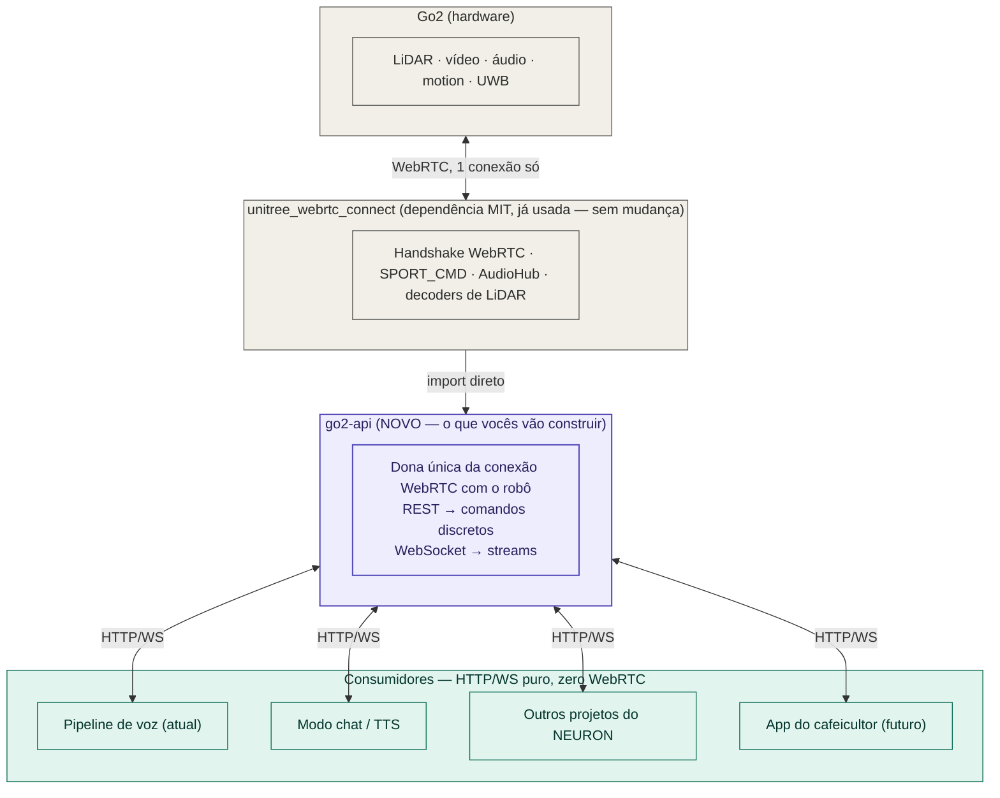

# Arquitetura proposta — `go2-api`

## Resumo em uma frase

A `go2-api` é uma camada nova, fina, que fica **entre** a biblioteca `unitree_webrtc_connect` (que já existe e continua sendo usada, sem mudança) e **todo mundo que hoje precisa falar com o robô** — incluindo o próprio projeto de controle por voz de vocês, que passa a ser *cliente* da API em vez de dono da conexão com o robô.

---

## 1. Onde ela entra — diagrama de camadas



*Cinza = já existe hoje · roxo = novo, é o que vocês vão construir · verde-azulado = consumidores da API.*

**A resposta direta pra "onde minha API entra":** ela não substitui a `unitree_webrtc_connect` — ela **assume a responsabilidade que hoje está espalhada dentro do `robot_control`**, generaliza, e vira o único ponto de contato com o robô. Tudo que hoje precisa saber WebRTC/AES/`aiortc` passa a precisar saber só HTTP e WebSocket.

---

## 2. O que muda no fluxo que já existe

### Antes (hoje)
```
TV Box → TCP → inferência (Whisper + SentenceTransformer) → Redis "go2:commands"
                                                                    ↓
                                          robot_control (importa unitree_webrtc_connect
                                          direto, monta SPORT_CMD, fala com o robô)
```

### Depois — decidido: sem Redis nesse caminho
```
TV Box → TCP → inferência (sem mudança) ──HTTP direto, não-bloqueante──▶ go2-api
                                                                          │
                                                              POST /commands/sport
                                                                          │
                                                          unitree_webrtc_connect → Go2
```

**Decisão registrada**: o `robot_control` e o Redis somem do caminho de comando de voz — a inferência chama a `go2-api` direto via HTTP. Isso não abre mão de garantia nenhuma: o Redis pub/sub de hoje já não confirma entrega (mensagem publicada sem ninguém ouvindo simplesmente some — problema documentado no dossiê). Uma resposta HTTP (`200`/erro) já é uma confirmação melhor do que o que existe hoje.

**Duas condições pra isso não criar um problema novo** (o motivo de existir uma camada no meio nunca foi "confiabilidade", foi "não travar o pipeline de voz esperando o robô se mexer"):
1. A `go2-api` responde **assim que aceita o comando** (`202 Accepted`), não depois que o robô termina de executar fisicamente.
2. A chamada, do lado da inferência, roda como tarefa solta (`asyncio.create_task`), nunca como `await` bloqueante no meio do loop principal.

**O que preserva o isolamento de processo** (o valor real que o Redis dava) não era o Redis em si — é **serem containers separados**. Chamada HTTP entre dois containers separados preserva isso do mesmo jeito: se a `go2-api` cair, a chamada falha/dá timeout, a inferência captura a exceção e segue rodando, sem travar.

**Fora de escopo por enquanto**: o modo chat (que também usa Redis pub/sub hoje) não foi implementado corretamente ainda — fica de fora dessa decisão. Primeiro a `go2-api`, o redesenho do modo chat (incluindo se ele também abre mão do Redis) fica pra depois, como projeto separado.

---

## 3. Por que isso resolve um problema estrutural, não só estético

O WebRTC é ponto-a-ponto — **só uma conexão por vez** com o robô (é a causa do `RobotBusyError` que vocês já tratam). Isso significa que, hoje, se dois processos quisessem falar com o robô ao mesmo tempo, um dos dois perderia.

A `go2-api`, sendo a **única dona da conexão WebRTC**, resolve isso por construção: ela mantém 1 conexão física com o robô, mas multiplexa quantos consumidores HTTP/WS quiserem — o pipeline de voz, o modo chat, um projeto novo de outro colega do NEURON, tudo ao mesmo tempo, sem brigar pela mesma conexão. Isso não é só "mais bonito", é a solução pro limite físico do protocolo.

---

## 4. Superfície da API v1 — mapeamento completo do que já existe na lib

Organizado em cinco grupos: os quatro primeiros são REST (comando pontual), o quinto é WebSocket (fluxo contínuo).

### 4.1 Postura e movimento
| Já existe na lib | Endpoint sugerido | Nota |
|---|---|---|
| `SPORT_CMD["StandUp"/"StandDown"/"Sit"/"RiseSit"/"BalanceStand"/"RecoveryStand"/"Damp"]` | `POST /commands/posture` `{"cmd": "stand_up"}` | Um endpoint, `cmd` como enum — mapeamento direto do que o `robot_control` já faz. |
| `SPORT_CMD["Move"]` | `POST /commands/move` `{"vx","vy","vyaw","duration_s"}` | A API cuida do reenvio a 20-50Hz internamente. Exige token de controle (seção 13 do dossiê). |
| `SPORT_CMD["StopMove"]` | `POST /commands/stop` | **Bypassa fila e lease** — sempre executa na hora, de qualquer cliente. |
| `SwitchGait`, `SpeedLevel`/`GetSpeedLevel` | `PUT/GET /commands/speed` | |

### 4.2 Gestos e "truques"
| Já existe | Endpoint sugerido | Nota |
|---|---|---|
| `Hello`, `Stretch`, `FingerHeart`, `WiggleHips`, `Content`, `Dance1/2`, `Scrape`, `Pose` | `POST /commands/gesture` `{"cmd": "hello"}` | Baixo risco físico, já testado em produção pelo `robot_control`. |
| `FrontFlip`, `BackFlip`, `Handstand`, `MoonWalk`, `Bound` | `POST /commands/trick` `{"cmd": "front_flip", "confirm": true}` | **Separado deliberadamente do grupo acima** — risco real de queda/dano físico; exige flag de confirmação explícita. Nunca testados por vocês. |
| `SPORT_CMD_MCF` (marcha avançada: `TrotRun`, `StaticWalk`) | — | **Fora do v1** — exige trocar o robô pro modo MCF primeiro (`motion_switcher`, ainda não reverso-engenheirado — dossiê 12.2/12.3). |

### 4.3 Dispositivo (áudio, LED, volume)
| Já existe | Endpoint sugerido | Nota |
|---|---|---|
| `WebRTCAudioHub` (upload, play, pause, resume, delete, megafone) | `POST /audio/upload`, `POST /audio/play`, `POST /audio/pause`, `.../resume`, `DELETE /audio/{id}`, `POST /audio/megaphone` | Classe já pronta na lib, zero engenharia reversa — é só empacotar. Substitui o `CMD_PLAY_AUDIO` do modo chat. |
| `VUI` volume (api_id `1003`/`1004`) | `PUT/GET /device/volume` `{"level"}` | Payload confirmado no exemplo oficial. |
| `VUI` brilho (api_id `1005`/`1006`) | `PUT/GET /device/brightness` | |
| `VUI` cor/pisca (api_id `1007`) | `PUT /device/led` `{"color","duration_s","flash_cycle_ms"}` | |

### 4.4 Segurança e controle
| Já existe | Endpoint sugerido | Nota |
|---|---|---|
| `OBSTACLES_AVOID_API` (`SWITCH_SET`/`SWITCH_GET`) | `PUT/GET /safety/obstacle-avoidance` `{"enabled"}` | Payload confirmado no exemplo oficial — **saiu da lista de lacunas**, já é v1. |
| — (design nosso, não da lib) | `POST /control/acquire`, `POST /control/release` | O lease com token+expiração desenhado na seção 13 do dossiê. |
| `SPORT_MOD_STATE`/`LOW_STATE` | `GET /status` | Snapshot pontual (bateria, modo, conectado) — versão contínua vai pro grupo 4.5. |

### 4.5 Streams (WebSocket)
| Já existe | Canal sugerido | Nota |
|---|---|---|
| `ULIDAR_ARRAY` + decoder `native` | `/ws/lidar` | **Trocar o decoder padrão antes de expor** — `libvoxel` devolve malha, não pontos (dossiê seção 3.1). |
| `WebRTCVideoChannel` | `/ws/video` | |
| `LOW_STATE`/`SPORT_MOD_STATE` em alta frequência | `/ws/telemetry` | IMU, força nas patas, posição/velocidade em tempo real. |

### Fora do escopo do v1
Navegação autônoma (`uslam`), UWB/side-follow, modo MCF — payloads ainda não reverso-engenheirados (dossiê seção 12.2/12.3). Entram como v2+, se fizer sentido investir nisso depois.

---

## 5. Fases de implementação (ordem sugerida, reaproveitando o que já existe)

1. **Grupos 4.1 + 4.4 (postura/movimento + controle)** primeiro — é o que o `robot_control` já faz, só reorganizado; risco mínimo, e já traz o mecanismo de lease resolvido desde o início.
2. **Grupo 4.3 (dispositivo — áudio/LED/volume)** — biblioteca já pronta na lib (`WebRTCAudioHub`, `VUI`), ganho rápido, esforço baixo.
3. **Grupo 4.5 (streams)** — mais trabalho de implementação (gerenciar múltiplos assinantes WebSocket), mas nenhuma engenharia reversa pendente.
4. **Grupo 4.2, parte "trick"** — só depois de testar fisicamente cada comando, dado o risco de queda; entra atrás de tudo que é seguro.
5. **MCF, navegação, UWB** — fica de fora propositalmente, é território ainda não mapeado (dossiê seção 12.2/12.3).

---

## 6. O que NÃO muda — limitações herdadas

A `go2-api` é uma camada de organização, não mágica — ela herda tudo que o dossiê já documentou:
- Ainda só uma conexão física com o robô por vez (é a razão de ela existir, não algo que ela resolve na origem).
- Ainda sujeita a quebrar se a Unitree mudar o protocolo (os IDs de `SPORT_CMD` já mostraram isso).
- Ainda não alcança `rt/lowcmd` (controle por junta) — segue exigindo o SDK oficial se algum dia isso for necessário.
- Ainda herda o modelo de "confiança por protocolo, não por identidade" descrito no dossiê seção 7.4 — no firmware de vocês, qualquer um na rede local com a chave estática consegue parear. Vale a `go2-api` adicionar sua **própria** camada de autenticação (ex: API key simples) para quem se conecta *nela*, já que o robô não oferece isso de fábrica no firmware de vocês.

---

*Documento complementar ao `dossie_go2.md` — usa as descobertas de código-fonte já registradas lá como base técnica.*
